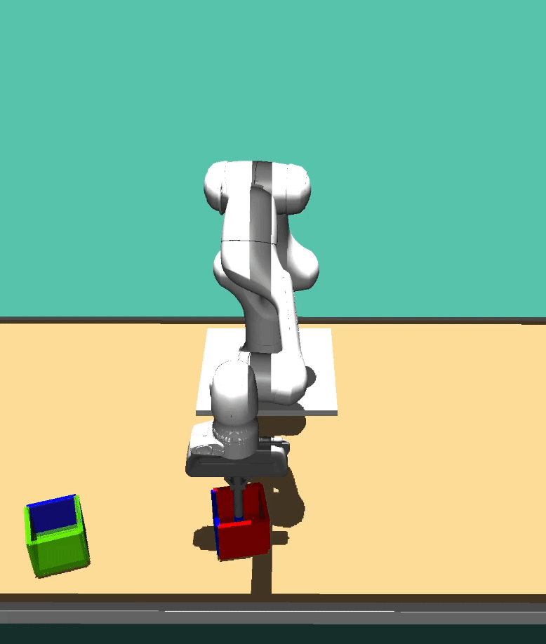

## Transformer-based Off-policy Episodic Reinforcement Learning (TOP-ERL)
### Under review in ICLR25

  
  
  

  

### Episodic RL, What and Why?
Episodic RL is a distinct family of RL that emphasizes the maximization of returns over entire episodes, typically lasting several seconds, rather than optimizing the intermediate states during environment interactions. Unlike SRL, ERL shifts the solution search from per-step actions to a parameterized trajectory space, leveraging techniques like Movement Primitives (MPs) (Schaal, 2006; Paraschos et al., 2013) for generating action sequences. This approach enables a broader exploration horizon (Kober & Peters, 2008),
captures temporal and degrees of freedom (DoF) correlations (Li et al., 2024), and ensures smooth transitions between re-planning phases (Otto et al., 2023).

  
  

  

### Use Movement Primitives for Trajectory Generation
Episodic RL often uses the movement primitves (MPs) as a paramterized trajectory generator. In TOP-ERL, we use the ProDMP (Li et al., 2023) for fast computation and better initial condition enforcement. A simple illustration of using MPs can be seen as follows:

  

  
